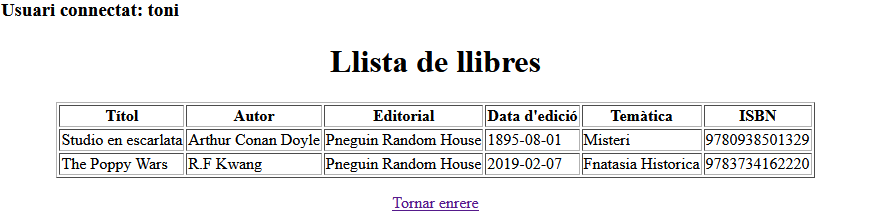
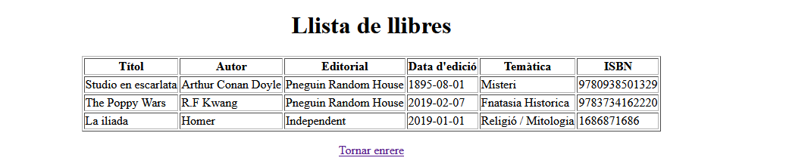
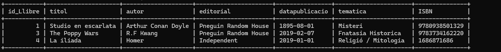
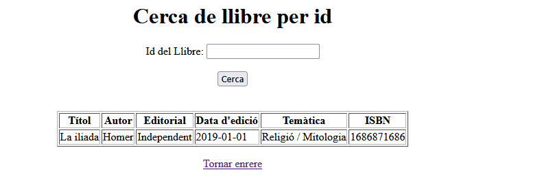

# Documentació de la pràctica

## Respostes a les preguntes proposades.
### 1. Per què al servei estem utilitzant mètodes que no hem declarat explícitament al repositori? Com és possible?
Això es deu a que aquests mètodes son deribats del Spring Data JPA. En el controller només hem de declarar-ho de manera senzilla:

    List<Llibre> findAll();
    
Un cop tenim això, Spring Data JPA fa la resta de la feina, i nosaltres només l'hem de cridar quan ho trobem necessari. 

### 2. El repositori pot elegir fer l’extends de les interfícies PagingAndSortingRepository o de JpaRepository. En què es diferencien aquestes dues amb la interfície CrudRepository?
La seva gran diferencia és la quantitat de serveis CRUD que ofereixen. PagingAndSortingRepository aporta metodes per a paginació i mètodes de classificació, i JpaRepository aporta altres mètodes relacionats amb JPA, com are el buidat de context de persistècia i la eliminació de registres per lots. D'altra banda, CrudRepository només ofereix les accions bàsiques de CRUD. 

### 3. Què significa Optional<Classe> i per a què serveix?
Optional<> es una API de la classe Java que em utilitzat per a crear un safeguard en cas que no es trobi el resultat demanat- Es a dir, que la classe pugui retornar un valor o un null sense que el programa col·lapsi. 

### 4. Per què el controlador utilitza el servei i no la seva implementació?
S'usa el servei per a permetre un ús de les interfícies, mantenir l'arquitectura més estable i neta, i millorar la testabilitat del codi i el seu funcionament. 

## Documentació de les proves fetes. 
1. Test fet durant la execució inicial del programa, i comprovació que es presenta la pantalla inicial. S'ha creat i comprovat que l'execució no es possible si no s'introdueix el usuari/contrasenya. 

2. Execució de la segona pantalla correcte, i el usuari es transeferix correctament entre elles. Els tres link/possibles accions son accessibles. 

3. Els llibres previament creats estan guardats a la BBDD i es mostren correctament a la taula de continguts. El link per a anar a la pantalla anterior també funciona correctament. 

4. La pantalla de creació es mostra correctament, i el llibre afegit es desa correctament a la BBDD. La llibreria també mostra que el llibre s'ha desat correctament enviant a l'usuari a la taula de registres. S'ha comprovat que en cas que un dels camps no s'ha emplenat correctament, la pantalla emet un missatge d'error. 

5. La búsqueda per id funciona correctament, i el llibre cercat (en aquesta ocasió el llibre que s'ha desat previament) es mostra correctament. 

